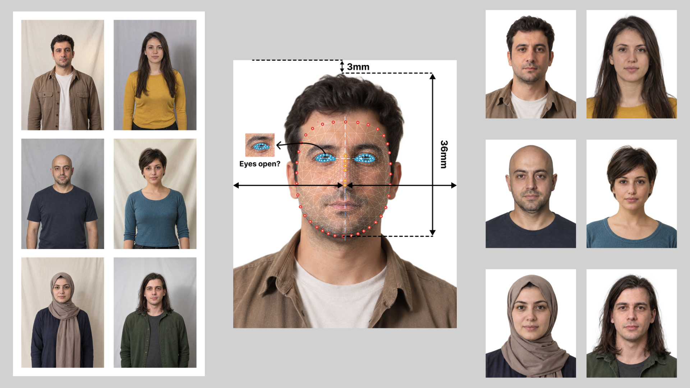
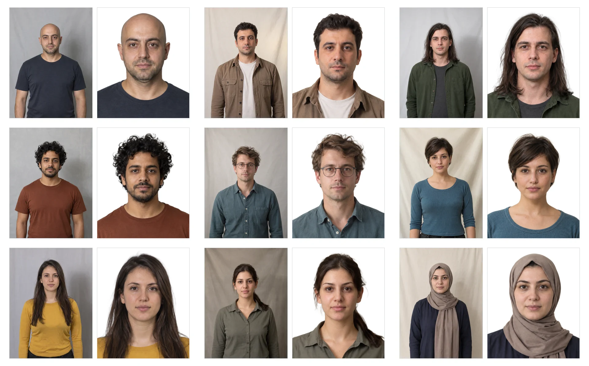
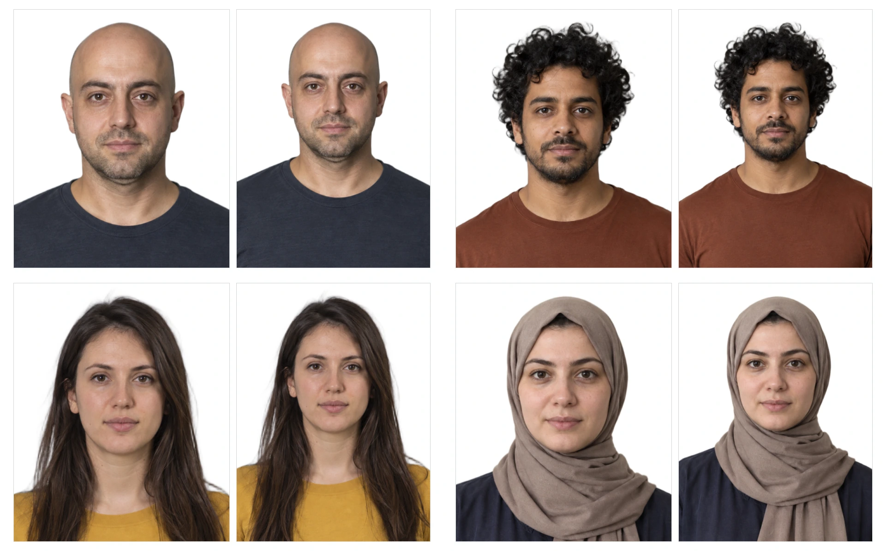
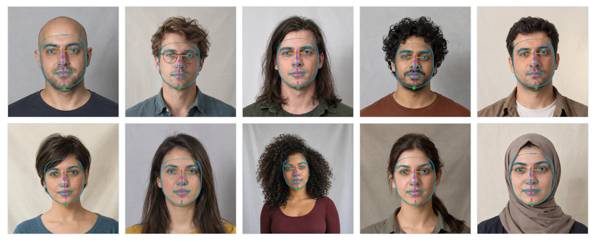

# BiyoVes

BiyoVes prepares biometric and Turkish vesikalık portraits locally. It detects facial geometry, removes the background, and places the head on a white canvas for the selected format.

[Project website](https://mehmetaytugyuruk.github.io/biyoves/)

## Run BiyoVes

You need Python 3.10–3.13. Clone or download this repository, open a terminal in the `biyoves` folder, then run:

**macOS / Linux**

```bash
git clone https://github.com/mehmetaytugyuruk/biyoves.git
cd biyoves
python3 -m venv .venv
source .venv/bin/activate
python -m pip install -e .
python app.py
```

**Windows PowerShell**

```powershell
git clone https://github.com/mehmetaytugyuruk/biyoves.git
Set-Location biyoves
py -3 -m venv .venv
.venv\Scripts\Activate.ps1
python -m pip install -e .
python app.py
```

Open <http://127.0.0.1:7860>, upload one photo or a folder, choose a format, and start processing. The first run downloads the required models, so stay online until it finishes. Later runs can work offline.

## Supported platforms

The table describes the intersection of the pinned MediaPipe, PyTorch, torchvision, and OpenCV wheels. Linux x86_64 is covered by the required CI unit-test matrix; the other compatible targets are not claimed as CI-tested by this repository.

| Operating system | Architecture | Python | Status |
| --- | --- | --- | --- |
| Linux (glibc 2.28+) | x86_64 | 3.10–3.13 | Supported; CI-tested |
| macOS 14+ | arm64 | 3.10–3.13 | Supported by dependency wheels; not CI-tested |
| Windows 10/11 | x86_64 | 3.10–3.13 | Supported by dependency wheels; not CI-tested |

Linux arm64, macOS x86_64, and Windows arm64 are not release targets for 2.3.0 because the required dependency wheel set is incomplete for those combinations.

<p align="center">
  
</p>

## What it does

- Removes the original background with soft foreground matting.
- Corrects eye-line roll and estimates the facial midline and head placement.
- Processes a single photo or a folder of photos.
- Creates biometric and vesikalık outputs on a white background.
- Keeps photos and model inference on your computer; the app does not enable public sharing.

## Batch processing benchmark

BiyoVes processed 1,000 photos in 9 minutes 7 seconds. At an assumed expert preparation time of 2 minutes per photo, preparing the same 1,000 photos manually would take 2,000 minutes (33 hours 20 minutes).

## Examples and dataset

Each pair shows a synthetic input portrait and its BiyoVes output.

<p align="center">
  
</p>

The companion [BiyoVes Faces dataset](https://huggingface.co/datasets/mehmetaytugyuruk/biyoves-faces) contains 10 synthetic portraits and 40 eye-state images: 10 identities, each with open eyes, both eyes closed, the image-left eye closed, and the image-right eye closed. Its dataset card explains the labels, metadata, intended use, limitations, and CC BY 4.0 license. Portrait IDs and eye-state IDs are independent.

## Output formats

| Format | Physical size | Preferred visible-head height |
| --- | --- | --- |
| Biometric | 50 × 60 mm | 36 mm |
| Vesikalık | 45 × 60 mm | 31 mm |

These are BiyoVes composition targets, not a guarantee of acceptance by an authority. The vesikalık preset may reduce scale slightly to avoid clipping wide hairstyles.

<p align="center">
  
</p>

## How processing works

```text
Photo
  ↓
EXIF orientation
  ↓
MediaPipe Face Landmarker
  ↓
Eye-line correction and facial placement
  ↓
BiRefNet Lite background matting
  ↓
White 50 × 60 mm or 45 × 60 mm canvas
```

<p align="center">
  
</p>

The Quality Gate recommends a manual review when the smaller eye-openness score is below `0.20`, when multiple faces are detected, or when the placed head/chin clips the output canvas. The largest detected face is selected. With multiple faces, the matte is used only when it can be linked to that selected face; a shared or unlinked foreground component fails safely instead of mixing one face's geometry with another person's matte. This is a review aid, not an official biometric compliance check.

## Models and limitations

On first use, BiyoVes downloads and verifies pinned BiRefNet Lite and MediaPipe Face Landmarker assets, then stores them in `~/.cache/biyoves` (or `BIYOVES_CACHE_DIR`). Model weights are not included in this repository. Review [BiRefNet's model card](https://huggingface.co/ZhengPeng7/BiRefNet_lite-matting) and [MediaPipe documentation](https://ai.google.dev/edge/mediapipe/solutions/vision/face_landmarker) for upstream terms.

Very fine hair, unusual poses, severe occlusion, poor lighting, or unclear foreground separation can reduce quality. BiyoVes does not guarantee acceptance by a government authority or compliance with official photo requirements.

## Development

Install the package with its development dependencies, then run the unit test suite with:

```bash
python -m pip install -e ".[dev]"
python -m pytest -m "not smoke" tests/ -q
```

The real model smoke test downloads and verifies the pinned model assets, runs the production pipeline, and validates an output image. It is marked separately because it is slow and network-dependent:

```bash
python -m pytest -m smoke tests/test_smoke.py -q
```

GitHub Actions runs the unit matrix and package build on pushes and pull requests. The real smoke test is available as a manually triggered workflow and caches the verified model assets.

Synthetic evaluation inputs in `data/` are published separately in the [Hugging Face dataset](https://huggingface.co/datasets/mehmetaytugyuruk/biyoves-faces). Processed examples in `examples/outputs/` are generated locally and are not part of that dataset or this code repository.

## License

BiyoVes source code is released under the [MIT License](LICENSE). The dataset has its own [CC BY 4.0 license](https://huggingface.co/datasets/mehmetaytugyuruk/biyoves-faces).
